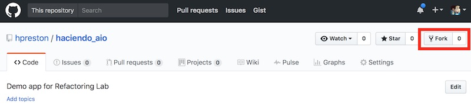

# Haciendo!

Haciendo is a fun little application designed to be used as part of an Application Refactoring Lab.  In the lab, you will take a "Monolithic Application" where all of the services for the application are installed and running on a single virtual machine, and "refactor" it to break each service into seperate Docker images in a "microservice" architecture.  

The lab guide can be found at [Refactoring Hands-On Lab](https://github.com/hpreston/haciendo_lab).

The application code can be found at [Haciendo Application](https://github.com/hpreston/haciendo_aio).   

This README provides the details on how to startup the initial application in development mode leveraging Vagrant on your local machine.  

# Technical Bits

Here is some basic information about the application that maybe helpful.  

## Web

In the `web/` directory you will find the Web front end for the application.  It is written in Python, leverages the Flask web framework and bootstrap styling to create a responsive and clean web interface.  

When a user submits a request in the web form, it is `POSTED` back to the web server where the user request is forward to the **API** service for processing.  

It is designed to run with Python 3.5, though may run in other versions of Python.  For convenience, a `requirements.txt` file is included in the application directory.  

After starting the application, it will be available at [http://localhost:15080](http://localhost:15080).

## API

In the `api\` directory you will find the API layer for the application.  It is written in Python and leverages Flask and Flask_Restful to create a REST API layer for the application.  

The API Service uses the free translation API provided by [Yandex](http://translate.yandex.com) to convert English -> Spanish.  This service, while free, does require an API key to use.  See below for setting up an account.  

It is designed to run with Python 3.5, though may run in other versions of Python.  For convenience, a `requirements.txt` file is included in the application directory.  

After starting, the following API is available to be used directly.  

```bash
curl -X POST localhost:15000/api/score \
  -d 'line=hello' \
  -d 'phonenumber=55555555555'
```

## SMS

In the `sms\` directory you will find the SMS Service for the application.  It is written in Python and leverages itty to create a basic REST API.  Haciendo leverages Tropo to send and recieve SMS messages to public phone numbers, and uses the tropo-webapi-python library.  

To run this application, you will need an account with Tropo that has been enabled for outbound SMS messaging.  

This service **MUST** run using Python 2.7 due to limitations of the leveraged libraries and modules.  

After starting the following APIs are available.  

* Retrieve information about the Tropo Application

```bash
curl localhost:15001/application
```
* Retrieve the phone number registered to the application 

```bash
curl localhost:15001/application/number
```

* Send a hello message from the Tropo Service

```bash
curl localhost:15001/hello/5555555555
```

## Developer Tooling 

To run and develop this application, some key tools are being leveraged.  

[Vagrant](http://vagrantup.com), along with Virtual Box is being used to quickly enable developers to startup the full application simply with `vagrant up`.  A sample Vagrantfile is provided in the repo that only needs to have your Tropo Credentials inserted to get started.  You will need to install Vagrant onto your local workstation before starting.  Vagrant should install Virtual Box automatically.  

[ngrok](https://ngrok.com/) is being used to expose the Tropo Service running within the Vagrant VM to the internet so that API calls can be successfully sent from the Tropo Cloud to the application.  The installation of ngrok into the Vagrant managed VM is done automatically, and no special account is needed to use this tool.  

[Docker](http://docker.com) will be used during the lab exercise to build and execute containers for each of the services of Haciendo.  You should install Docker on your workstation before beginning the lab.  

Though you can complete this lab with any IDE of your choice, [PyCharm Community Edition](https://www.jetbrains.com/pycharm/download/) was used in the development and testing of the application.  

# Setup 

Pre-Req List

### Accounts

* [GitHub](https://github.com) - You will need a free account with GitHub.  
* [Docker Hub](https://hub.docker.com) - You will need a free account with Docker Hub.
* [Cisco Tropo](https://tropo.com) - You will need a free account with Tropo.  
  * Your account needs to be enabled for **sending** SMS Messages.  You can request this by sending an email to [support@tropo.com](mailto:support@tropo.com).  This can take 1-2 business days so be sure to send this email in advance of completing the lab.  
* [Yandex Translate API](https://api.yandex.com/translate/) - You will need an account and free API key for the Yandex Service
    * Go to [https://api.yandex.com/translate/](https://api.yandex.com/translate/) and click to get a "Free API Key".  
    * Sign-up and copy your key to a text file to keep handy
    * Keys can be found after sign-up at [https://tech.yandex.com/keys/](https://tech.yandex.com/keys/)

### Software Installed on Workstation 

* [git](https://git-scm.com/downloads) 
* [Vagrant + Virtual Box](https://www.vagrantup.com/downloads.html)
    * Pre-download Vagrant box `vagrant box add centos/7 --provider virtualbox`
* [Docker for X](https://www.docker.com)


# Starting the Haciendo All-In-One Application 

* Log into GitHub and create a Fork of the [Haciendo Repo](https://github.com/hpreston/haciendo_aio).  



* Clone your forked repo locally to your workstation.    

```bash 
git clone http://github.com/<YOUR ACCOUNT>/haciendo_aio 
cd haciendo_aio
```

* Make a copy of the Sample Vagrantfile to use.  

```bash
cp Vagrantfile.sample Vagrantfile
```

* Open Vagrantfile and add your own Tropo Username and Password to the command that starts the SMS service.  Around line 103 in the Vagrantfile.  
  * **NOTE: DO NOT ADD THEM TO `Vagrantfile.sample`**
  * *Optional:  Change the `--tropoprefix XXXX` value to a different area code.  But note that not all area codes are supported.  Check Tropo dev docs for details.*

```
    # Start sms service, log output to sms_log.log
    # *** Update the following line with your Tropo User and Password.
    nohup python haciendo_sms.py -p 5001 -t TROPO_USER -w TROPO_PASS --tropoprefix 1419 --tropourl ${SMS_NGROK_ADDRESS} > sms_log.log 2>&1 &
```

* Open Vagrantfile and add your Yandex Key to the configuration to start the API Service.  Around line 112 in the Vagrantfile
    * **NOTE: DO NOT ADD THEM TO `Vagrantfile.sample`**

```
    # Set the Yandex Key
    # *** Update the following line with your Yandex Key
    YANDEX_KEY="YOUR_KEY"
```    

* Configure Vagrant to install Virtual Box Additions at boot.  This is needed to keep the application directory synced between your local workstation and the VM that is running the application.  

```bash
vagrant plugin install vagrant-vbguest
```

* `vagrant up` and start the Application Dev Instance.  Partial output provided below for reference.  
    * This step can take 3-5 minutes to complete.  
    * *If you do not have a local copy of the centos/7 box already, this step will automatically download one. This can take several minutes depending on Internet connection speeds.*
        * Pre-download the box: `vagrant box add centos/7 --provider virtualbox`  

```bash
# Output
[ Vagrant start and provisioning output omitted ]
.
.
.
[ When completed you will see this information ]

==> default: *******************************************************
==> default: Haciendo Application Started
==> default:  
==> default: Application services running: 
==> default: [1]   Running                 ./ngrok http 5001 &  (wd: /home/vagrant)
==> default: [2]   Running                 nohup python haciendo_sms.py -p 5001 -t TROPO_USER -w TROPO_PASS --tropoprefix 1419 --tropourl ${SMS_NGROK_ADDRESS} > sms_log.log 2>&1 &  (wd: /vagrant/sms)
==> default: [3]-  Running                 nohup python haciendo_api.py -p 5000 -t http://localhost:5001/score > api_log.log 2>&1 &  (wd: /vagrant/api)
==> default: [4]+  Running                 nohup python haciendo_web.py -p 5080 -a http://localhost:5000/api/score > web_log.log 2>&1 &
==> default:  
==> default: Browse to http://localhost:15080 to view web interface
==> default: API running on http://localhost:15000
==> default: SMS running on http://localhost:15001 
==> default:     and mapped to ngrok tunnel http://7000a93ea.ngrok.io
==> default: *******************************************************
```

* You should now be able to browse to `http://localhost:15080` and view the Web Interface.  


* You can open the following files to view the real-time logs of each service.  *If a file is missing then the application didn't start correctly.*  
    * `sms/sms_log.log`
    * `api/api_log.log`
    * `web/web_log.log`

* Enter an English phrase into the form and your own phone number to send the translation via SMS.  
    * **Remember: You are responsible for any SMS messages sent from your Tropo Account.**

# Developer Notes

* Because of the way that ngrok and the SMS service interact to provide the Tropo capabilities, you can't simply `vagrant suspend` and `vagrant resume` and expect the application to restore completely.  The recommended steps to stop and restart are: 

```bash
# Stop the vagrant box
vagrant halt

# Re-Start the vagrant box and start the app
vagrant up --provision 

# You can also restart the running box to clear any issues
vagrant reload --provision 
```